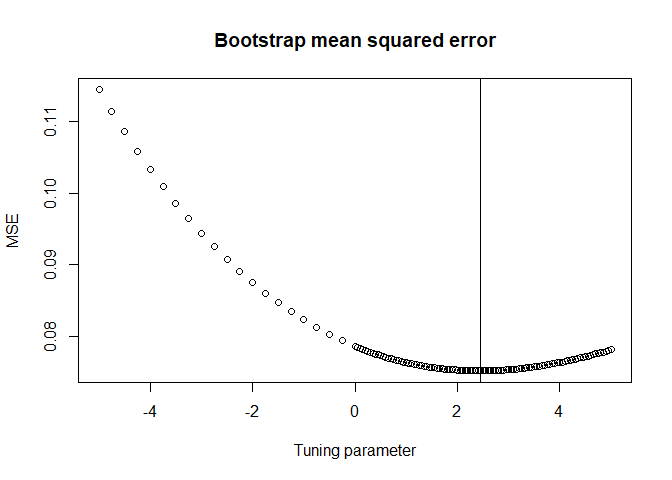

<!-- README.md is generated from README.Rmd. Please edit that file -->

# Personalized Angle (PAN) regression

This tutorial describes the installation of the R package panreg, and
the data analysis using the personalized angle regression described in
Hellton (2022), *Penalized angular regression for personalized
predictions*. The R package is still under development, and this
represents the first working version.

## Installation

First, you need to install the panreg package from GitHub respository of
khellton, using the following code:

``` r
# install.packages("devtools")
devtools::install_github("khellton/panreg")
```

Then load the data and functions used for the analysis.

``` r

# Load the R package
library(panreg)

# Load the data (available from https://web.stanford.edu/~hastie/ElemStatLearn/data.html)
data.raw <- read.table(file = 'data/prostate.data')

# Divide the data in test and traning set with approximately 2/3 and 1/3 in each
train.index <- rep(FALSE,dim(data.raw)[1])
train.index[sample(dim(data.raw)[1], 32)] <- TRUE

Y.train <- scale(data.raw$lpsa[train.index],center=TRUE,scale = TRUE)
X.train <- scale(data.matrix(data.raw)[train.index,1:8],center=TRUE,scale = TRUE)
n <- length(Y.train)
n #32 observations in the training set
#> [1] 32

# Use the scaling from training data
Y.test <- scale(data.raw$lpsa[!train.index],
                center= attr(Y.train,"scaled:center"),
                scale = attr(Y.train,"scaled:scale"))

X.test <- scale(data.matrix(data.raw)[!train.index,1:8],
                center= attr(X.train,"scaled:center"),
                scale = attr(X.train,"scaled:scale"))

n.test <- length(Y.test)
n.test #65 observations in the training set
#> [1] 65
```

# Analysis and prediction error

``` r

# Run bootstrap procedure to determine tuning parameter with 2000 bootstrap samples
PAN.bootstrap <- PAN.bootstrap(X.train = X.train, Y.train = Y.train,
                               bootstrap.samples = 500,
                               lambdaMax = 5, stepSize = 0.05,
                               lambdaMaxNeg = 5,stepSizeNeg = 0.25)
#> [1] "Bootstrap samples: 50"
#> [1] "Bootstrap samples: 100"
#> [1] "Bootstrap samples: 150"
#> [1] "Bootstrap samples: 200"
#> [1] "Bootstrap samples: 250"
#> [1] "Bootstrap samples: 300"
#> [1] "Bootstrap samples: 350"
#> [1] "Bootstrap samples: 400"
#> [1] "Bootstrap samples: 450"
#> [1] "Bootstrap samples: 500"
head(PAN.bootstrap)
#> $MSE
#>   [1] 0.11438048 0.11138436 0.10853609 0.10584410 0.10329013 0.10087227
#>   [7] 0.09858663 0.09643172 0.09440857 0.09251014 0.09072984 0.08906310
#>  [13] 0.08751068 0.08606171 0.08471309 0.08346420 0.08231050 0.08125032
#>  [19] 0.08028478 0.07941220 0.07862751 0.07862751 0.07847995 0.07833591
#>  [25] 0.07819547 0.07805856 0.07792515 0.07779536 0.07766954 0.07754732
#>  [31] 0.07742882 0.07731357 0.07720196 0.07709376 0.07698927 0.07688830
#>  [37] 0.07679047 0.07669559 0.07660364 0.07651461 0.07642847 0.07634522
#>  [43] 0.07626483 0.07618767 0.07611387 0.07604303 0.07597515 0.07591020
#>  [49] 0.07584827 0.07578930 0.07573322 0.07568001 0.07562966 0.07558213
#>  [55] 0.07553741 0.07549622 0.07545836 0.07542333 0.07539108 0.07536162
#>  [61] 0.07533490 0.07531093 0.07528967 0.07527110 0.07525520 0.07524196
#>  [67] 0.07523135 0.07522336 0.07521795 0.07521511 0.07521482 0.07521706
#>  [73] 0.07522180 0.07522902 0.07523893 0.07525147 0.07526644 0.07528383
#>  [79] 0.07530359 0.07532573 0.07535020 0.07537699 0.07540608 0.07543744
#>  [85] 0.07547105 0.07550688 0.07554491 0.07558525 0.07562815 0.07567319
#>  [91] 0.07572035 0.07576961 0.07582094 0.07587432 0.07592971 0.07598715
#>  [97] 0.07604646 0.07611349 0.07617488 0.07626921 0.07631694 0.07638003
#> [103] 0.07644459 0.07654376 0.07660225 0.07669138 0.07675454 0.07685918
#> [109] 0.07691837 0.07700908 0.07708069 0.07719926 0.07726070 0.07735664
#> [115] 0.07743429 0.07756414 0.07763037 0.07775473 0.07782401 0.07795414
#> [121] 0.07802278 0.07814907
#> 
#> $lambdas
#>   [1] -5.00 -4.75 -4.50 -4.25 -4.00 -3.75 -3.50 -3.25 -3.00 -2.75 -2.50 -2.25
#>  [13] -2.00 -1.75 -1.50 -1.25 -1.00 -0.75 -0.50 -0.25  0.00  0.00  0.05  0.10
#>  [25]  0.15  0.20  0.25  0.30  0.35  0.40  0.45  0.50  0.55  0.60  0.65  0.70
#>  [37]  0.75  0.80  0.85  0.90  0.95  1.00  1.05  1.10  1.15  1.20  1.25  1.30
#>  [49]  1.35  1.40  1.45  1.50  1.55  1.60  1.65  1.70  1.75  1.80  1.85  1.90
#>  [61]  1.95  2.00  2.05  2.10  2.15  2.20  2.25  2.30  2.35  2.40  2.45  2.50
#>  [73]  2.55  2.60  2.65  2.70  2.75  2.80  2.85  2.90  2.95  3.00  3.05  3.10
#>  [85]  3.15  3.20  3.25  3.30  3.35  3.40  3.45  3.50  3.55  3.60  3.65  3.70
#>  [97]  3.75  3.80  3.85  3.90  3.95  4.00  4.05  4.10  4.15  4.20  4.25  4.30
#> [109]  4.35  4.40  4.45  4.50  4.55  4.60  4.65  4.70  4.75  4.80  4.85  4.90
#> [121]  4.95  5.00
#> 
#> $lambda.min
#> [1] 2.45

# Plot the MSE tuning curve
plot(PAN.bootstrap$lambdas,PAN.bootstrap$MSE,
     main = 'Bootstrap mean squared error',
     xlab = 'Tuning parameter', ylab = 'MSE')
abline(v=PAN.bootstrap$lambda.min)
```

<!-- -->

``` r

# Predict for the test set using PAN
PAN.predictions.path <- PAN(X.train = X.train, Y.train = Y.train, 
                            X.test = X.test, 
                            lambdaMax = PAN.bootstrap$lambda.min, stepSize = 0.005)

# Use the PAN prediction for the last tuning parameter value
PAN.predictions <- PAN.predictions.path$preditions[,length(PAN.predictions.path$lambdas)] 

beta.ols <- solve(t(X.train)%*%X.train)%*%t(X.train)%*%Y.train
gamma0 <- beta.ols/norm(beta.ols)

# Predict for the test set using OLS regression
OLS.predictions <-  c(X.test %*% beta.ols)

# Compute the mean squared error on test set
mean(( Y.test - c(X.test %*% beta.ols))^2)
#> [1] 0.3903571
mean(( Y.test - PAN.predictions)^2)
#> [1] 0.3753914
```
